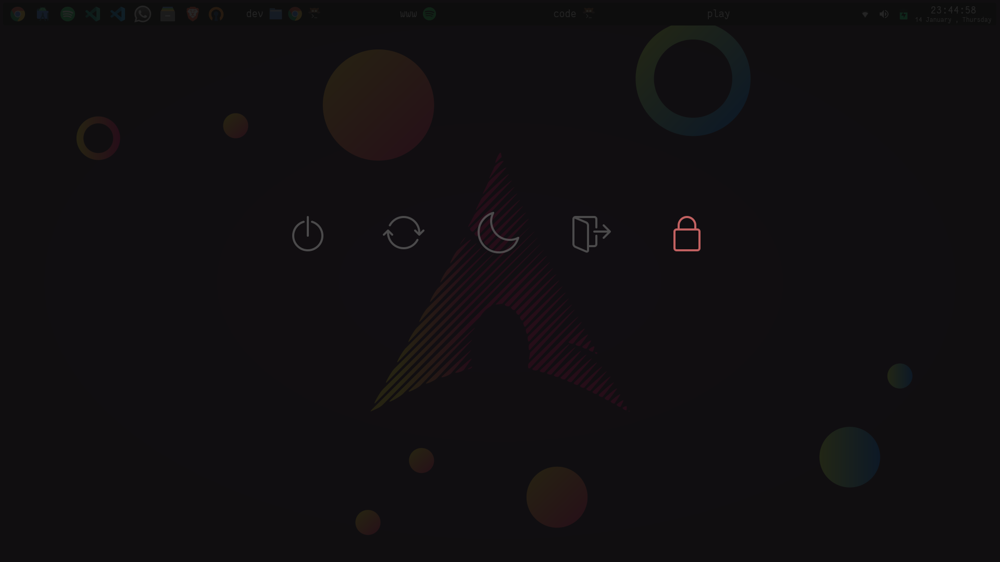

# Rofi Blurry Powermenu 



A simple yet beautiful powermenu made with [Rofi](https://github.com/davatorium/rofi). Includes a "fake" blur effect for the current screen.

## Installation

```zsh
# Clone repo
cd ~/.config
git clone https://github.com/fchwpo/rofi-powermenu.git rofi-powermenu

# Install dependencies and copy files
./rofi-powermenu/install-powermenu.sh 
```
